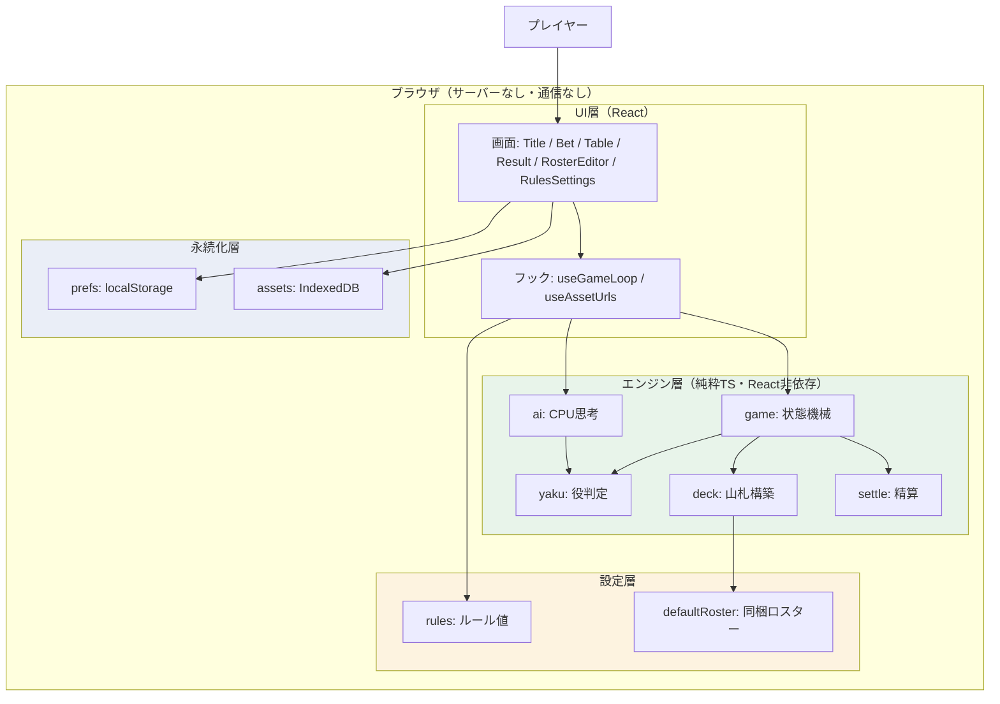
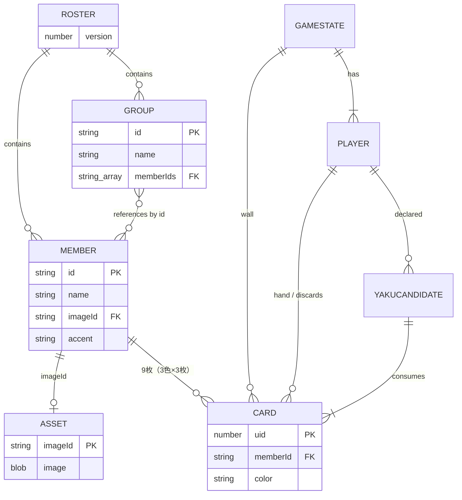
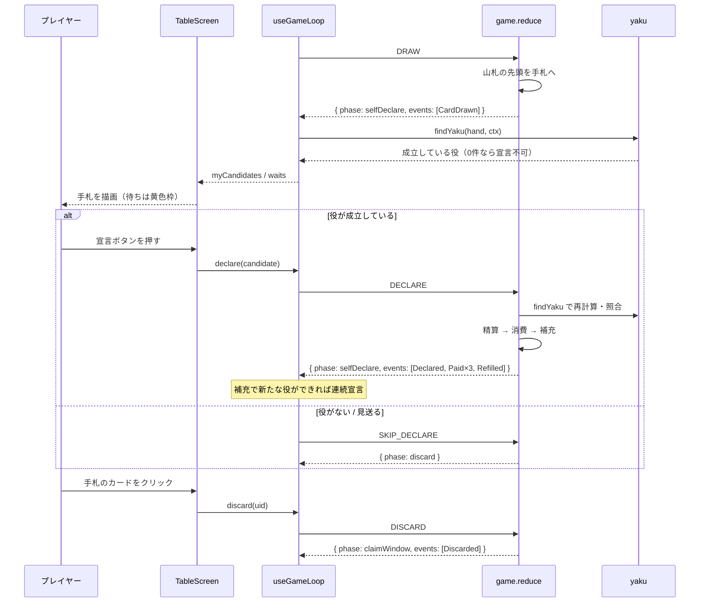
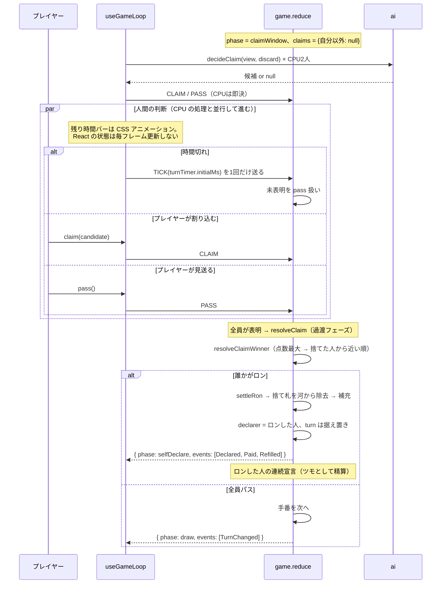
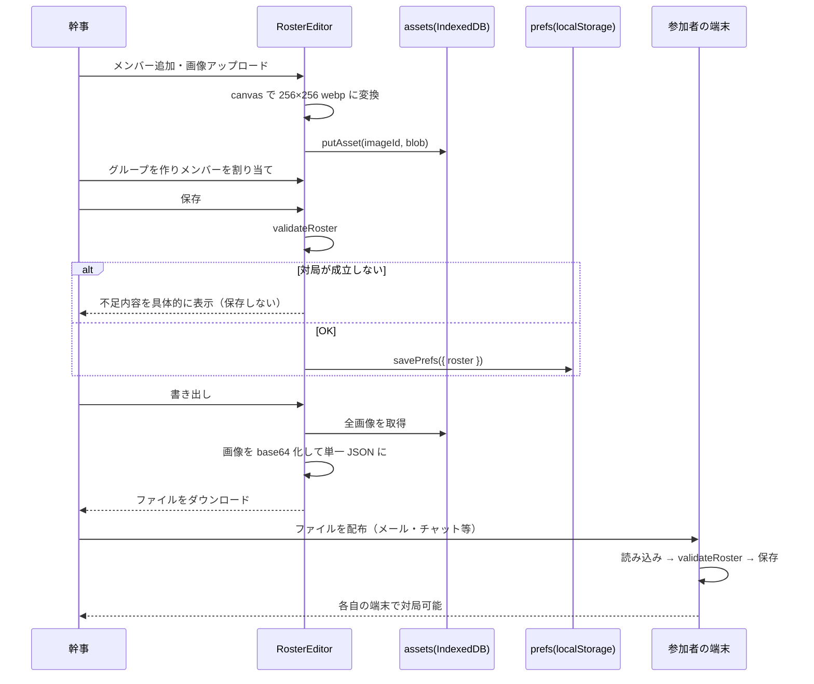
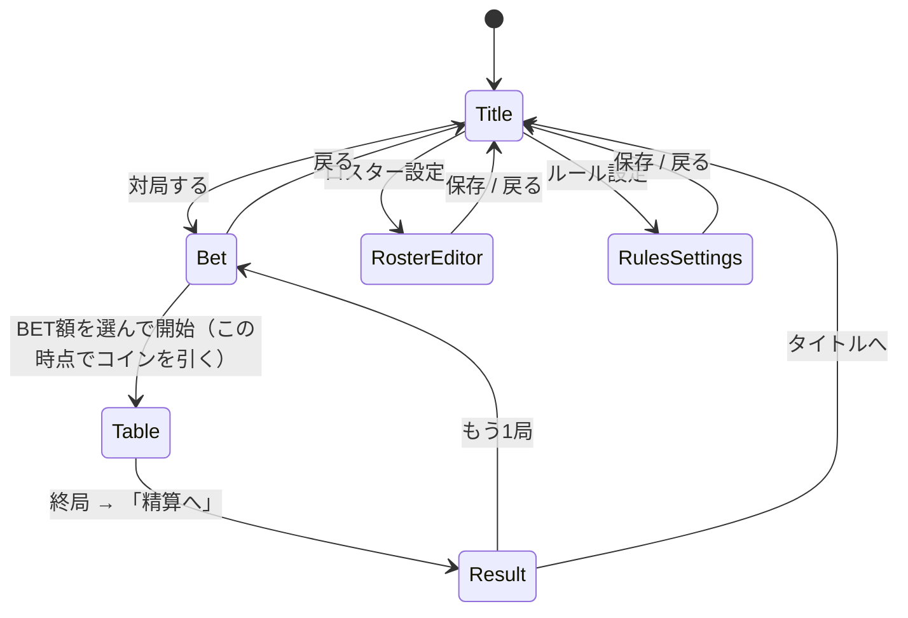

<!-- 生成日: 20260807 -->

# 機能設計書 (Functional Design Document)

本書は [product-requirements.md](product-requirements.md) の要件を技術的にどう実現するかを定義する。

**記載の前提**: **全ステップが実装済み**であり、本書の記載は実際のコードに基づく。
実装中の判断で当初案から変えた箇所は、理由を添えて本文に残している
（設計判断1〜4・カードの見た目の節など）。

## システム構成図



**最重要の構造的制約**: エンジン層は UI 層と設定層に依存しない（矢印が一方向）。
`.oxlintrc.json` の `no-restricted-imports` で `src/engine/` からの `react` /
`src/config/` の import を禁止しており、`npm run lint` が違反を検出する。

## 技術スタック

| 分類             | 技術                  | 選定理由                                                                             |
| ---------------- | --------------------- | ------------------------------------------------------------------------------------ |
| 言語             | TypeScript ~6.0       | ドメインの不変条件を型で表現するため。`strict` + `verbatimModuleSyntax` を有効化      |
| ビルド           | Vite 8                | 開発サーバの起動が速く、静的ファイルへの出力がそのまま静的ホスティングに載る          |
| UI               | React 19              | 状態からの宣言的な描画。`useReducer` がエンジンのリデューサと相性が良い               |
| テスト           | Vitest 4              | Vite と設定を共有できる。100局の自動対局を1秒以内で回せる速度                         |
| 静的解析         | oxlint                | Vite テンプレートの既定。依存方向の制約を `no-restricted-imports` で機械的に担保      |
| 整形             | Prettier              | 差分の議論を減らす                                                                   |
| アニメーション   | framer-motion         | カードの移動と役成立の演出。対局画面でのみ import しバンドルへの影響を局所化          |
| E2E              | Playwright            | 1局を通しで進める検証とスクリーンショット取得                                         |
| データベース     | **なし**              | サーバーを持たない方針。永続化はブラウザの localStorage / IndexedDB のみ              |
| 状態管理ライブラリ | **なし**            | `useReducer` + Context で足りる規模。依存を増やさない                                 |

## データモデル定義

### カードとキャラクター

```typescript
type ColorId = 'pink' | 'blue' | 'orange'
type MemberId = string
type GroupId = string
type PlayerId = number

/** 山札・手札・河を構成する1枚。uid は1局を通じて一意。 */
interface Card {
  readonly uid: number
  readonly memberId: MemberId
  readonly color: ColorId
}

/** カードに描かれるキャラクター。imageId は IndexedDB 上の画像キー。 */
interface Member {
  readonly id: MemberId
  readonly name: string
  readonly imageId?: string // 未設定なら頭文字 + accent で描画
  readonly accent?: string // 16進カラー
}

/** キャラクターのまとまり（原作の「期生」、組織なら部署・チームに相当）。3〜5人。 */
interface Group {
  readonly id: GroupId
  readonly name: string
  /** カードの角に出す記号（トランプのスート相当）。未設定なら名前の1文字目。 */
  readonly symbol?: string
  readonly memberIds: readonly MemberId[]
}

/** 1ゲームで使うキャラクター定義の全体。ユーザーが編集・共有する単位。 */
interface Roster {
  readonly version: number
  readonly members: readonly Member[]
  readonly groups: readonly Group[]
}
```

**制約**:

- `Member.id` はロスター内で一意
- `Group.memberIds` は `Member.id` を参照し、グループ内で重複しない
- `Group.memberIds.length` は 3〜5（役判定が対応する範囲）
- `Group.symbol` は省略可能。省略時は名前の1文字目を使う（`groupSymbolOf`）
- グループ数 ≥ `rules.groupsPerGame`（既定4）
- 「最も人数の少ない `groupsPerGame` 個のグループ」の合計カード枚数 ≥ `deckSize`
  （最悪ケースで山札が組めることを保証する）

### 役

```typescript
type YakuKind = 'triple' | 'group3' | 'group4' | 'group5'
type WinKind = 'tsumo' | 'ron'

/** 役として扱えるグループ人数の範囲。yaku.ts と deck.ts の単一の真実。 */
const MIN_YAKU_GROUP_SIZE = 3
const MAX_YAKU_GROUP_SIZE = 5

interface YakuCandidate {
  readonly kind: YakuKind
  readonly sameColor: boolean
  readonly cards: readonly Card[] // 消費されるカード
  readonly bonusCount: number // 含まれるボーナスメンバーの枚数
  readonly score: number
}

/** 役判定に必要な局の文脈。手札だけでは判定できないため引数で渡す。 */
interface YakuContext {
  readonly activeGroups: readonly Group[]
  readonly bonusMemberIds: readonly MemberId[]
  readonly rules: RulesConfig
}
```

### 対局状態

```typescript
type Phase = 'draw' | 'selfDeclare' | 'discard' | 'claimWindow' | 'resolveClaim' | 'gameOver'

/** reduce が外部に返しうるフェーズ。過渡フェーズ resolveClaim を含まない。 */
type ObservablePhase = Exclude<Phase, 'resolveClaim'>

type ClaimDecision = YakuCandidate | 'pass' | null // null = 未表明

interface Player {
  readonly id: PlayerId
  readonly isCpu: boolean
  readonly hand: readonly Card[]
  readonly score: number
  readonly discards: readonly Card[]
  /** 成立させた役。消費済みカードの置き場でもある（カード保存則の検査に使う）。 */
  readonly declared: readonly YakuCandidate[]
}

interface GameState {
  readonly phase: ObservablePhase
  readonly turn: PlayerId
  /** selfDeclare で宣言権を持つプレイヤー。ロンの連続宣言では turn と食い違う。 */
  readonly declarer: PlayerId
  readonly players: readonly Player[]
  readonly wall: readonly Card[]
  readonly activeGroups: readonly Group[]
  readonly activeMembers: readonly Member[]
  readonly bonusMemberIds: readonly MemberId[]
  readonly lastDiscard: Card | null
  readonly lastDiscardBy: PlayerId | null
  /** 捨てた人以外だけがキーを持つ部分マップ。 */
  readonly claims: Readonly<Partial<Record<PlayerId, ClaimDecision>>>
  readonly claimTimerMs: number
  readonly chainCount: number
  readonly seed: number
  readonly rngState: number
}
```

**制約（対局を通じて成立する不変条件）**:

- `players.length === rules.playerCount`
- 全プレイヤーの点数の合計 = `rules.startingScore × rules.playerCount`（**点数保存則**）
- `wall` + 全 `hand` + 全 `discards` + 全 `declared[].cards` の枚数 = `rules.deckSize`、
  かつ `uid` に重複がない（**カード保存則**）
- `phase !== 'gameOver'` のとき、各プレイヤーの手札枚数 = `expectedHandSize(state, id, rules)`
- `wall.length` は単調減少
- `rngState` は対局中に変化しない（進行に乱数を使わない）

### アクションとイベント

```typescript
type Action =
  | { readonly type: 'DRAW' }
  | { readonly type: 'DECLARE'; readonly playerId: PlayerId; readonly candidate: YakuCandidate }
  | { readonly type: 'SKIP_DECLARE' }
  | { readonly type: 'DISCARD'; readonly uid: number }
  | { readonly type: 'CLAIM'; readonly playerId: PlayerId; readonly candidate: YakuCandidate }
  | { readonly type: 'PASS'; readonly playerId: PlayerId }
  | { readonly type: 'TICK'; readonly deltaMs: number }

/** リデューサが状態と一緒に返す演出用イベント。UI はこれを見てアニメーションを再生する。 */
type GameEvent =
  | { type: 'CardDrawn'; playerId: PlayerId; card: Card }
  | { type: 'Discarded'; playerId: PlayerId; card: Card }
  | { type: 'Declared'; playerId: PlayerId; candidate: YakuCandidate; winKind: WinKind }
  | { type: 'Paid'; from: PlayerId; to: PlayerId; amount: number }
  | { type: 'Refilled'; playerId: PlayerId; cards: readonly Card[] }
  | { type: 'TurnChanged'; playerId: PlayerId }
  | { type: 'GameOver'; ranking: readonly PlayerId[]; reason: GameOverReason }
```

### ルール設定

```typescript
interface YakuScore {
  readonly base: number
  readonly sameColor: number
}

interface RulesConfig {
  readonly playerCount: number // 4
  readonly handSize: number // 7（手番中のみ8）
  readonly deckSize: number // 100
  readonly groupsPerGame: number // 4
  readonly colors: readonly ColorId[]
  readonly copiesPerMemberColor: number // 3 → 1メンバー9枚
  readonly minGroupSize: number // 3
  readonly maxGroupSize: number // 5
  readonly startingScore: number // 1000（推定値）
  readonly bonusMemberCount: number // 1
  readonly bonusPerCard: number // 90
  // 人間の持ち時間。ロンと打牌で同じ残量を共有する（Step 4b）
  readonly turnTimer: {
    readonly initialMs: number // 20000
    readonly decrementMs: number // 5000（使い切ったときだけ減る）
    readonly minMs: number // 5000（下限）
  }
  readonly maxChainDeclare: number // 8
  readonly scores: Readonly<Record<YakuKind, YakuScore>>
  readonly bet: { options: readonly number[]; rankMultiplier: readonly number[] }
}
```

**点数表（既定値）**:

| 役      | 基本点 | 同色時 | 備考                     |
| ------- | ------ | ------ | ------------------------ |
| triple  | 120    | 840    | 7倍                      |
| group3  | 180    | 540    | **推定値**（出典なし）   |
| group4  | 300    | 840    | 2.8倍                    |
| group5  | 480    | 1800   | 3.75倍                   |
| ボーナス | +90/枚 | 同左   | 役に含まれる1枚につき    |

**重要な制約**: 全ての点数が3の倍数である。ツモ時に「他3人から1/3ずつ」を
整数演算だけで完結させるための制約であり、変更時も維持する必要がある。

### ER図



## コンポーネント設計

### エンジン層（`src/engine/`）

依存の向きは `game → win → turnFlow → gameDraft → errors` の一方向で循環がない。

#### `rng.ts` — シード付き乱数

**責務**: 決定的な擬似乱数の提供。**エンジンは `Math.random()` を使わない。**

```typescript
interface Rng {
  next(): number // 0 <= x < 1
  state(): number // createRng(state) で続きから再現できる
}
function createRng(seed: number): Rng
function randomInt(rng: Rng, maxExclusive: number): number
function shuffle<T>(items: readonly T[], rng: Rng): T[]
function pickSome<T>(items: readonly T[], count: number, rng: Rng): T[]
```

**依存関係**: なし

#### `deck.ts` — ロスター検証・山札構築・配牌

**責務**: ロスターの妥当性検証、今局のグループ選出、山札構築、ボーナス選出、配牌

```typescript
class RosterValidationError extends Error {
  readonly errors: readonly string[]
}
interface RosterValidationResult {
  ok: boolean
  errors: readonly string[]
  warnings: readonly string[]
}

function validateRoster(roster: Roster, rules: RulesConfig): RosterValidationResult
function setupGame(roster: Roster, rules: RulesConfig, rng: Rng): GameSetup
```

**`validateRoster` は信頼できない入力の検証点**。ユーザーが読み込んだ JSON が
配列でない・フィールドが欠けているといった壊れた構造でも例外を投げず、
エラー一覧として返す（Step 6 のロスター読み込みで必須）。

**依存関係**: `rng.ts`, `types.ts`

#### `yaku.ts` — 役判定（中核）

**責務**: 成立している役の列挙、ロン判定、最良候補の選択、待ち計算

```typescript
function findYaku(hand: readonly Card[], ctx: YakuContext, required?: Card): YakuCandidate[]
function bestYaku(candidates, hand, ctx): YakuCandidate | null
function computeWaits(hand: readonly Card[], ctx: YakuContext): WaitInfo
function groupYakuKind(size: number): YakuKind
```

**依存関係**: `score.ts`, `types.ts`

#### `score.ts` — 点数計算

```typescript
function scoreYaku(kind: YakuKind, sameColor: boolean, bonusCount: number, rules): number
function countBonusCards(cards: readonly Card[], bonusMemberIds: readonly MemberId[]): number
```

**設計上の要点**: `scoreYaku` は**カードを引数に取らない**。役の点数は
「役種・同色可否・ボーナス枚数」だけで決まり、どのカードを選ぶかに依存しないという
不変条件を型レベルで強制している。

#### `settle.ts` — 精算

```typescript
interface SettlementResult {
  scores: readonly number[]
  payments: readonly Payment[]
}
function settleTsumo(scores, winner, amount): SettlementResult
function settleRon(scores, winner, discarder, amount): SettlementResult
function toPaidEvents(result: SettlementResult): GameEvent[]
```

#### `game.ts` — 対局状態機械（中核）

**責務**: アクションの受付、フェーズ遷移、イベント発行

```typescript
function createGame(roster, rules, seed, options?): GameState
function reduce(state: GameState, action: Action, rules: RulesConfig): ReduceResult
// ReduceResult = { state: GameState; events: readonly GameEvent[] }
```

**タイマーを持たない純粋リデューサ**。時間の経過は UI 層が `TICK` で供給する。
`rules` は `GameState` に埋め込まず引数で受け取る（全エンジン関数と一貫）。

**補助モジュール**:

| モジュール          | 責務                                                       |
| ------------------- | ---------------------------------------------------------- |
| `gameDraft.ts`      | リデューサ内部の可変表現と不変条件ガード                   |
| `gameSelectors.ts`  | 状態からの導出（`yakuContextOf` / `expectedHandSize`）     |
| `claims.ts`         | 割り込み優先度解決・宣言された役の再計算による検証         |
| `turnFlow.ts`       | 手番の進行と終了判定                                       |
| `win.ts`            | 和了1回分（精算 → 消費 → 補充 → 連続宣言）                 |
| `errors.ts`         | `IllegalActionError`                                       |

#### `ai.ts` — CPU 思考

**責務**: 捨て札の選択、宣言の判断

```typescript
/** CPU に見せてよい公開情報だけを集めたビュー。他家の手札を渡す経路が型として存在しない。 */
interface AiView {
  readonly selfId: PlayerId
  readonly hand: readonly Card[] // 自分の手札のみ
  readonly ctx: YakuContext
  readonly discardsByPlayer: readonly (readonly Card[])[] // 河（公開情報）
  readonly wallCount: number // 残り枚数だけ。中身は見えない
  readonly scores: readonly number[]
}

function toAiView(state: GameState, playerId: PlayerId, rules: RulesConfig): AiView
function evaluateTargets(view: AiView, config: AiConfig): TargetEvaluation[]
function chooseDiscard(view: AiView, config?: AiConfig): Card
function decideDeclare(view: AiView): YakuCandidate | null
function decideClaim(view: AiView, discard: Card): YakuCandidate | null
```

**`toAiView` が `GameState` に触れる唯一の場所**。カンニングは実装ミスではなく型エラーになる。

#### `autoplay.ts` — 自動対局

```typescript
function playGameToEnd(options: AutoplayOptions): AutoplayResult
function summarizeAutoplay(options): AutoplaySummary
```

### UI 層（`src/ui/`）— Step 4 で実装済み

#### `loopReducer.ts` — 対局ループの純粋ロジック

React に触れない部分をここへ集約する。この切り出しにより、UI の振る舞いの大半を
jsdom なしで単体テストできる。

```typescript
/** UI 層だけが持つ状態。エンジンの GameState は純粋なまま保つ。 */
interface LoopState {
  readonly game: GameState
  readonly pending: readonly GameEvent[] // 演出待ちのイベントキュー
}

type LoopAction =
  | { type: 'ENGINE'; action: Action }
  | { type: 'EVENTS_CONSUMED'; count: number }
  | { type: 'RESTART'; state: LoopState }

function createLoopReducer(rules: RulesConfig): (s: LoopState, a: LoopAction) => LoopState

/** 次に自動で進める1手。null なら人間の入力待ち。 */
function decideAutoAction(game, rules, ai, humanSeat, delays?): AutoStep | null

/** 決定の同一性を表す文字列。自動進行の effect の依存に使う。 */
function autoActionKey(game: GameState, action: Action): string
```

#### `useGameLoop.ts` — タイマーの駆動だけを担う

**責務**: エンジンと React の接続、CPU の思考ディレイ、宣言窓の時間切れ

```typescript
function useGameLoop(options): {
  state: GameState
  events: readonly GameEvent[]
  waits: WaitInfo
  declarable: readonly YakuCandidate[] // ツモで宣言できる役
  claimable: readonly YakuCandidate[] // ロンで割り込める役
  humanSeat: PlayerId
  canDiscard: boolean
  isClaimWindowOpen: boolean
  discard: (uid: number) => void
  declare: (candidate: YakuCandidate) => void
  claim: (candidate: YakuCandidate) => void
  pass: () => void // フェーズに応じて SKIP_DECLARE / PASS を切り替える
  restart: () => void
}
```

**設計判断1（ラッパー状態）**: `reduce` は戻り値が `{ state, events }` で引数が3つあるため、
React の `useReducer` の契約（`(state, action) => state`）と直接は噛み合わない。
`GameState` に `lastEvents` を持たせる案は「純粋なドメインスナップショット」という
前提を壊すため採らず、**UI 層にラッパー状態 `LoopState` を置く**。

**設計判断2（自動進行の依存）**: 自動進行の `useEffect` は `game` を丸ごと依存に取らず、
`autoActionKey` が返す**決定の同一性**だけを見る。`game` を依存にすると、
別の効果が状態を変えるたびに予約中のタイマーが破棄・再予約されてしまう。

**設計判断3（持ち時間）**: 残り時間は **CSS アニメーションで描画**し、
エンジンへは**時間切れの1回だけ**アクションを送る。

> 当初の設計では `requestAnimationFrame` で `TICK` を送り続け `claimTimerMs` を
> 減算する予定だったが、これを変更した。毎フレーム状態が変わると、
> 上記2の対策と組み合わせない限り **CPU の割り込み判断のタイマーが発火前に
> 毎回キャンセルされ、CPU が永久にロンできなくなる**。
> 1回の `setTimeout` にすることで原因そのものを取り除き、
> バーの描画も軽く、バックグラウンドタブでの間引きの影響も小さくなる。
> `claimTimerMs` は受付中に実時間を反映しなくなるが、この値を必要とするのは
> バーの表示だけで、それは CSS が担う。

**設計判断4（持ち時間の摩耗・Step 4b）**: 持ち時間はロン・打牌・宣言で
**1つの残量を共有**し、**使い切ったときだけ**短くなる（20 → 15 → 10 → 5 秒で下げ止まり）。
残量は `LoopState.timeLimitMs` が持ち、エンジンには入れない。

> 「毎回減る」にすると素早く打っているプレイヤーからも持ち時間を奪う。
> 減算は `TIMEOUT` アクションが**受理されたときだけ**行う。時間切れの発火と
> プレイヤーのクリックは無関係なタイミングで起こるため、
> 「押した直後に時間切れが走った」場合に減らすと、間に合った人が損をする。
>
> 打牌の時間切れは**引いたカードを自動で捨てる（ツモ切り）**。対象は
> `CardDrawn` イベントから追跡する（`LoopState.drawnUid`）。手札の末尾を見る実装は、
> 連続宣言で補充が入ると末尾が補充カードになるため誤ったカードを捨てる。
>
> 割り込みの時間切れでエンジンへ送る `TICK` の `deltaMs` は、経過時間ではなく
> **`turnTimer.initialMs`**。摩耗した持ち時間（最短5秒）を渡すと
> `claimTimerMs` が0にならず、自動パスが発火せずに対局が固まる。

**重要**: イベントの消費（アニメーション再生）はリデューサ内ではなく、
`pending` を見る `useEffect` 側で行う。リデューサ内で副作用を起こすと、
StrictMode の二重実行で演出が2回走る。

### 永続化層（`src/storage/`）— Step 5 以降

#### `prefs.ts` — localStorage

```typescript
interface Prefs {
  wallet: number
  roster: Roster
  rulesOverride: Partial<RulesConfig>
  lastSeed?: number
}
function loadPrefs(): Prefs
function savePrefs(prefs: Prefs): void
```

#### `assets.ts` — IndexedDB

```typescript
function putAsset(imageId: string, blob: Blob): Promise<void>
function getAsset(imageId: string): Promise<Blob | undefined>
function deleteAsset(imageId: string): Promise<void>
```

**なぜ IndexedDB か**: localStorage は約5MBの制限があり、20人分の顔写真で溢れる。
画像は必ず IndexedDB に Blob として置く。

## ユースケース図

### UC-1: 自分の手番（引く → 捨てる）



### UC-2: 他家の捨て札への割り込み（ロン）



### UC-3: ロスターを作って共有する



## 画面遷移図



**実装**: `App.tsx` に `useReducer` の単純な画面ステートマシンを置く
（`ui/appReducer.ts` に純粋なロジックを分離し、`rules` を束縛したファクトリにする）。
ルーティングライブラリは導入しない（URL を持たない単一ページのため）。

**対局を生成できるのは `App` だけ。** BET を払うことと対局を始めることが不可分なので、
`useGameLoop` にやり直しの導線を持たせない（持たせると BET を経由せずに遊べてしまう）。
次の対局は `TableScreen` を `key={seed}` で作り直して始める。

`Table` から `Result` へは、終局オーバーレイの「精算へ」で進む。
**オーバーレイは対局の結果（順位と点数）、`ResultScreen` は金銭**を見せると役割を分け、
同じ内容を2画面に重ねない。

## API設計

**該当なし。** 本プロダクトはサーバーを持たず、外部との HTTP 通信を一切行わない。
配信されるのは静的ファイル（HTML / JS / CSS）のみで、実行時の通信は発生しない。

これは PRD のプライバシー要件（アップロードした画像を外部へ送信しない）を
**構造的に**満たすための設計判断でもある。通信するコードが存在しなければ、漏洩経路も存在しない。

## アルゴリズム設計

### A-1: 山札構築（プール → 100枚）

**目的**: ロスターから今局の山札を作る。同一シードで完全に再現できること。

```
1. selectGroups: ロスターから groupsPerGame(4) 個のグループを無作為抽出
2. collectMembers: 選ばれたグループに属する全メンバーを集める（12〜16人）
3. buildCardPool: 各メンバー × 3色 × 3枚 = 9枚 のカードを生成（108〜144枚）
4. shuffle → 先頭 deckSize(100) 枚を取り出す  ← 残りは今局に登場しない
5. selectBonusMembers: 山札に実際に含まれるメンバーから bonusMemberCount(1) 人を選ぶ
6. deal: 先頭から handSize(7) 枚ずつ playerCount(4) 人へ配り、残り72枚を壁とする
```

**設計上の要点（ステップ5）**: ボーナスメンバーの選出母集団を「登場メンバー全員」ではなく
**山札に実際に含まれるメンバー**に限定する。プールから100枚を抜き出す際、
あるメンバーの9枚すべてが山札外に落ちることがあり、その場合ボーナスが一度も引けない
「死にボーナス」になるため。候補順は山札のシャッフル順に依存させず ID 昇順に固定し、
同一シードなら常に同じボーナスが選ばれるようにする。

### A-2: 役判定 `findYaku`

**目的**: 手札から成立している役をすべて列挙する。

```
1. 3カードの列挙:
   - memberId でグループ化し、3枚以上あるメンバーごとに候補を作る
   - 同じ色が3枚以上あれば、その色の同色版も候補に追加
2. N人組の列挙:
   - 今局の各グループについて、全メンバーを1枚以上持っているか判定
   - 色 c について全メンバーが色 c を持つなら、色 c の同色版も追加
3. 各候補を YakuCandidate に変換:
   - sameColor は「実際に消費するカードの色が1種類か」で判定する
   - score = scoreYaku(kind, sameColor, bonusCount, rules)
4. 同一のカード集合を消費する候補を重複除去
```

**計算量**: メンバー数 ≤ 16、グループ数 = 4、色数 = 3 のため、
手札7〜8枚に対する走査は定数時間に近い。最適化より判定ロジックの一箇所集約を優先する。

**重要な性質**: **点数はカードの選び方に依存しない。** 3カードの構成メンバーは1人に固定され、
N人組の構成メンバーはグループ全員に固定されるため、`bonusCount` が色の選び方で変わらない。
したがって「点数を最大化するカードの組み合わせ」を探索する必要がない。

### A-3: ロン判定（`required` による絞り込み）

**目的**: 「その1枚がなければ成立しない役」だけを返す。手の内で既に成立している役で
ロンを主張できてはいけない。

```
1. hand（捨て札を含む）から全候補を列挙 → drafts
2. hand から required を1枚抜いた手札で全候補を列挙 → withoutRequired
3. 各候補の「シグネチャ」を kind:targetId:color の形で作る
4. drafts のうち、以下を両方満たすものだけを残す:
   (a) required のカードを消費している
   (b) シグネチャが withoutRequired の集合に含まれない
```

**条件 (b) が必要な理由**: 同じメンバー・同じ色の予備カードを持っている場合、
条件 (a) だけでは「手の内で既に成立している役」でロンを主張できてしまう。

**条件 (b) の副作用（意図的な仕様）**: 混色で既に成立している役でも、`required` によって
**同色版に格上げされる**場合はシグネチャが異なるためロンとして認められる。
これは誤ロン防止のちょうど裏返しであり、カード集合の比較だけで判定すると
この正当なロンまで弾いてしまう。

### A-4: 待ち計算 `computeWaits`（リーチ表示）

**目的**: あと1枚で役が完成するカードの種類と、それに寄与する手札カードを求める。

```
for 今局の登場メンバー m (12〜16人):
  for 色 c (3色):
    probe = { uid: 実カードと衝突しない負値, memberId: m, color: c }
    候補 = findYaku([...hand, probe], ctx, required = probe)
    best = bestYaku(候補)
    if best が存在:
      待ちに (m, c) を追加
      best.cards のうち probe 以外の uid を「寄与カード」に追加
```

**試行回数**: `groupsPerGame × maxGroupSize × colors.length` = 4 × 5 × 3 = 最大60回。
軽量な判定を数十回繰り返すだけなので、最適化するより判定ロジックを
`findYaku` の1箇所に集約できる利点の方が大きい。

**制約**: **1手先（テンパイ）専用**。CPU が2手以上先を評価したい場合は転用してはいけない。

### A-5: 最良候補の選択 `bestYaku`

```
1. 点数が最大のもの
2. 同点なら「消費後の残り手札の価値」が高いもの
3. それも同点なら uid 列が小さいもの（決定性のため）
```

**残り手札の価値**: `Σ n(n-1)`（メンバー別枚数）+ `Σ n(n-1)`（メンバー×色別枚数）
+ `Σ 保持数`（2人以上揃っている登場グループ）

**設計上の境界**: これは「エンジンが同点候補を決定的に1つ選ぶ」ためのタイブレークであり、
AI の戦術評価ではない。AI の評価関数をここに継ぎ足してはいけない。

### A-6: 精算（0クランプと点数保存則の両立）

**目的**: 残高不足の相手からも徴収しつつ、場全体の点数の総和を変えない。

```
collect(from, to, owed):
  payable = max(scores[from], 0)
  paid    = min(owed, payable)      ← 払える分だけ
  if paid <= 0: return
  scores[from] -= paid
  scores[to]   += paid              ← 引いた分だけ足す
  payments.push({ from, to, amount: paid })

ツモ: share = floor(amount / (playerCount - 1)) を自分以外の全員から collect
ロン: amount を放銃者から collect
```

**点数保存則が成り立つ理由**: 「引いた額」と「足した額」が常に同一の変数 `paid` であるため、
クランプが発生しても総和は構造的に変わらない。

### A-7: 割り込み優先度の解決

```
1. pass と未表明を除外
2. candidate.score が最大のものを選ぶ
3. 同点なら (playerId - discarder + playerCount) % playerCount が小さい方
   （捨てた人から反時計回りに近い方）
```

勝者以外は何も得ず、支払いも発生しない（頭ハネ）。

### A-8: CPU のターゲット評価

**目的**: 各ターゲット（メンバーの3カード / 各グループ）の価値を算出し、捨て札を選ぶ。

```
各ターゲットについて:
  need  = 完成までにあと必要な枚数（3カードなら 3 - 所持枚数、N人組なら 未所持メンバー数）
  score = scoreYaku(kind, sameColor, bonusCount, rules)
  value = score / (need + 1) ^ patience     ← 遠い役ほど割り引く

捨て札の選択:
  各手札カードについて cost = そのカードが寄与しているターゲットの value の合計
  終盤（wallCount < deckSize × 0.2）かつ safety > 0 なら:
    cost += safety × (色数 - そのメンバーが河に出ている枚数)   ← 河に出ていないカードを避ける
  cost が最小のカードを捨てる（同点は uid 昇順で決定的に）
```

**難易度パラメータ**:

| プリセット | patience | safety | 特徴                                       |
| ---------- | -------- | ------ | ------------------------------------------ |
| easy       | 2        | 0      | 目先の役だけを見る。安全牌を考えない       |
| normal     | 1.5      | 1      | 既定。遠い役もある程度追い、終盤は放銃を避ける |
| hard       | 1        | 2      | 高得点の役を粘り強く狙い、危険牌を強く避ける |

**制約**: 参照するのは `AiView`（公開情報）のみ。乱数を使わず、同じ入力に同じ判断を返す。

### A-9: カジノ精算（Step 5）

```
payout = floor(最終点数 × BET倍率 × 順位倍率) − BET額

BET倍率:  1000コイン → 1倍 / 2000コイン → 2倍
順位倍率: 1位 2.5 / 2位 1.5 / 3位 1.0 / 4位 1.0
```

**BET は選んだ時点で引き、精算時に払い戻しを足す**（`wallet − bet + gross`）。
増減の合計は `payout` と一致するが、精算時にまとめて差額を足す方式だと
**対局を中断してタブを閉じるだけで負けを帳消しにできる**。

所持コインが負になる経路は無い（BET 時に残高を検査し、払い戻しは常に0以上）ため、
0クランプは置いていない。BET 額に満たない場合はその BET を選択できない。
**充足判定は画面ではなく `appReducer` が行う**（ボタンの無効化は見た目の防御にすぎない）。

`BET倍率` は `bet / min(options)` として求める。選択肢の並び順に依存させないため。

**丸めは切り捨て**（払い戻しが厳密値を超えないことを保証する）。順位倍率が
0.5 の倍数である限り `整数 × 倍率` は厳密に表現でき、誤差は入らない。
この制約は `tests/config/rules.test.ts` で不変条件として検査している。

> **既定ルールでは端数が出ない。** 役の点数もボーナス加点もすべて偶数のため
> 最終点は常に偶数になり、2.5 倍しても整数になる（自動対局200局で端数0件）。
> 切り捨てが働かないことに正しさを預けないよう、丸めは奇数の点数を直接与える
> 単体テストで検証している。

> **この式は大きくプレイヤー有利になる。** 順位倍率の平均が 1.5 のため、
> 最終点が初期点と同水準なら収支は必ずプラスになる。自動対局200局の実測で
> 1局あたり **+1,017**（BET 1000）だった。計画書の調査結果どおりの値だが
> 実機では扱いが異なる可能性があり、`config/rules.ts` に `TODO(要実機確認)` を残している。

**順位はエンジンが `GameOver` イベントで確定させた値だけを使う。**
点数から画面側で並べ直すと、同点時の扱いが変わった瞬間に静かに食い違い、
それがそのまま順位倍率＝金額の誤りになる。フォールバックも置かない。

### カードの見た目（Step 6 のプレイテスト反映）

**アップロードした画像は切り取らない。** 縦横比を保ったまま長辺を 256px に収め、
表示も `object-fit: contain` にする。中央を正方形に切り出す実装だと
集合写真の端の人が消え、**利用者が選んだ画像と違うもの**になる。
カードの縦横比と画像の縦横比は違うので余白ができるが、これは意図どおり。

> 保存時に切らずに表示側で `cover` にすると、切り取る場所が変わるだけで
> 結果は同じになる。**保存と表示の両方を `contain` に揃える**必要がある。

**グループの記号をカードの左上と右下に出す**（トランプのスート相当）。
右下は 180 度回す。手札を扇状に重ねてもどちらかの角が必ず見えるため、
重ねたままグループを数えられる。

記号は `Group.symbol` の**上書き**として持ち、未設定なら名前の1文字目を使う
（`groupSymbolOf`）。上書きできるようにしたのは、「ステラ組」「ソレイユ組」のように
1文字目が似ているグループを区別するため。1文字目の取り出しは配列展開で行う
（`slice(0, 1)` は絵文字のサロゲートペアを壊す）。

## UI設計

### 対局画面のレイアウト

```
┌────────────────────────────────────────────┐
│              [対面プレイヤー]                │
│         伏せ7枚 / 点数 / 直近の捨て札         │
├──────┬──────────────────────────────┬──────┤
│ [左] │   山札残り: 43枚               │ [右] │
│ 伏せ │   ボーナス: ●ノヴァ            │ 伏せ │
│ 点数 │   今局: テラ組(4) シルヴァ組(4)  │ 点数 │
│ 捨札 │        マリン組(5) ステラ組(3)   │ 捨札 │
├──────┴──────────────────────────────┴──────┤
│  自分の河                                    │
├────────────────────────────────────────────┤
│  [手札 7〜8枚]  ← クリックで捨てる           │
│   □ □ ▣ □ ▣ □ □     ▣ = 黄色枠（待ち）      │
├────────────────────────────────────────────┤
│  [宣言ボタン]  ████████░░ 残り 2.4秒         │
└────────────────────────────────────────────┘
```

### カラーコーディング

| 用途                 | 色                          |
| -------------------- | --------------------------- |
| カード（ピンク）     | `#f7a8c4` 系グラデーション   |
| カード（青）         | `#a3c6f5` 系グラデーション   |
| カード（オレンジ）   | `#f7bd85` 系グラデーション   |
| **待ちに寄与するカード** | **黄色枠 `#ffd34d` + グロー** |
| ボーナスメンバー     | 金色バッジ `#f0d264`         |
| 最良の役（強調）     | アクセントカラーの枠         |

**色覚特性への配慮**: 色だけに依存させない。待ちは枠線の太さとグローで、
ボーナスはバッジのテキスト（`BONUS`）で識別できるようにする。

### 表示項目

| 項目             | 説明                         | フォーマット           |
| ---------------- | ---------------------------- | ---------------------- |
| 山札残り         | 残りカード枚数               | `43枚`                 |
| 点数             | 各プレイヤーの現在点         | 3桁区切り `1,240`      |
| 今局のグループ   | 名前と人数、達成状況         | `テラ組(4) 3/4`        |
| ボーナスメンバー | 名前 + カード上のバッジ      | `●ノヴァ`              |
| 宣言窓の残り時間 | バーの減少 + 秒数            | `████░░ 2.4秒`         |

### インタラクション

| 操作             | 有効な条件                                       |
| ---------------- | ------------------------------------------------ |
| 手札のクリック   | 自分の手番かつ `phase === 'discard'`             |
| 宣言ボタン       | 役が成立しているときのみ表示                     |
| パスボタン       | `phase === 'claimWindow'` かつ自分が未表明       |

**CPU の思考ディレイ**: 400〜900ms。エンジンには存在せず `useGameLoop` が `setTimeout` で作る。

### レスポンシブ

- 375px（スマートフォン縦）でカードサイズを縮小し、他家の情報を簡略表示
- 手札は横スクロールさせず、8枚が必ず1画面に収まるサイズにする

## ファイル構造

### localStorage

**キー**: `cc-pokajan:prefs`

```json
{
  "wallet": 12500,
  "roster": {
    "version": 1,
    "members": [{ "id": "m1", "name": "田中", "imageId": "img-m1", "accent": "#f7a8c4" }],
    "groups": [{ "id": "g1", "name": "開発チーム", "memberIds": ["m1", "m2", "m3"] }]
  },
  "rulesOverride": { "startingScore": 1500 },
  "lastSeed": 20260807
}
```

### IndexedDB

**DB名**: `cc-pokajan`、**ストア**: `assets`（keyPath: `imageId`）

| キー       | 値                                    |
| ---------- | ------------------------------------- |
| `img-m1`   | Blob（image/webp、256×256、〜30KB）   |

### ロスター書き出しファイル

**形式**: JSON 単一ファイル（画像を base64 で埋め込む）。依存ライブラリなしで入出力できる。

```json
{
  "format": "cc-pokajan-roster",
  "version": 1,
  "exportedAt": "2026-08-07T00:00:00.000Z",
  "roster": { "version": 1, "members": [], "groups": [] },
  "assets": { "img-m1": "data:image/webp;base64,UklGR..." }
}
```

**保存しないもの（transient）**: 対局中の `GameState`。リロードで破棄される。

## パフォーマンス最適化

| 項目                   | 対策                                                                     |
| ---------------------- | ------------------------------------------------------------------------ |
| 役判定の呼び出し回数   | `useMemo` で `seed` / `state` の変化時のみ再計算する                     |
| 自動対局100局          | 実測63ms。AI が `computeWaits` を使わず直接カウントすることで軽量に保つ |
| 画像の容量             | アップロード時に canvas で 256×256 webp へ縮小（1枚あたり〜30KB）       |
| objectURL のリーク     | `useAssetUrls` が画面単位でまとめて作り、アンマウント時に `revokeObjectURL` |
| framer-motion のバンドル | 対局画面でのみ import し、Title / Bet / Result には持ち込まない        |
| 再描画                 | カード1枚を独立コンポーネントにし、`key` を `uid` にして差分を最小化     |

## セキュリティ考慮事項

| 考慮事項                             | 対策                                                                       |
| ------------------------------------ | -------------------------------------------------------------------------- |
| **実在人物の顔写真の外部流出**       | 通信するコードを実装しない。画像処理は canvas / IndexedDB でブラウザ内完結  |
| **不正な役の宣言（点数偽装）**       | 宣言された候補を信用せず `findYaku` で再計算した候補に**置き換える**        |
| **壊れた・悪意あるロスターファイル** | `validateRoster` が構造から検証し、例外ではなくエラー一覧を返す             |
| **画像ファイルの偽装**               | canvas で再エンコードするため、元ファイルのメタデータやペイロードは残らない |
| **XSS（メンバー名の表示）**          | React の既定のエスケープに従う。`dangerouslySetInnerHTML` を使わない        |
| **ストレージ容量の枯渇**             | IndexedDB の書き込み失敗を捕捉し、容量不足を利用者に伝える                  |
| **公式著作物の混入**                 | 同梱ロスターはオリジナルの創作キャラのみ。リポジトリに公式素材を置かない    |

## エラーハンドリング

### エラーの分類

| エラー種別                     | 処理                                       | ユーザーへの表示                                       |
| ------------------------------ | ------------------------------------------ | ------------------------------------------------------ |
| `IllegalActionError`（進行不能）| 例外として送出。UI は操作を無効化して防ぐ  | （通常は到達しない。到達したらバグとして表示）         |
| `RosterValidationError`        | 保存・対局開始を中断                       | 「グループが3つしかありません。4つ以上必要です」       |
| ロスターファイルの形式不正     | 読み込みを中断、既存データは保持           | 「ファイルの形式が正しくありません: [具体的な内容]」   |
| 画像の読み込み失敗             | そのメンバーだけ頭文字表示にフォールバック | 「画像を読み込めませんでした」（対局は継続）           |
| IndexedDB の書き込み失敗       | 画像なしで保存を継続                       | 「画像を保存できませんでした。容量を確認してください」 |
| localStorage の読み込み失敗    | 既定値で継続                               | （表示しない。初回起動と同じ扱い）                     |
| BET 額 > 所持コイン            | その BET を選択不可にする                  | ボタンを無効化 + 「コインが足りません」                |
| 所持コイン < 最低 BET 額       | 補充の導線を出す（この状態でだけ）         | 「コインが足りません。補充して続けられます。」         |

> **補充の導線は必須。** BET のガードだけだと所持コインが尽きた時点でどのボタンも
> 押せなくなり、localStorage に残るためリロードしても回復しない（＝二度と遊べない）。
> 補充できる条件（`wallet < min(options)`）は `appReducer` が検査するので、
> 画面のボタンを隠すだけの防御にはしていない。

### 設計原則

**不正な入力を黙って無視しない。** 進行不能なアクションは `IllegalActionError` として
必ず表面化させる。「何も起きない」という形でバグが隠れることを防ぐため、
`switch` には必ず `default` を置き、判別共用体には `never` への代入による網羅性検査を付ける。

**ユーザー入力の検証と、プログラムの不変条件違反を区別する。**
前者（壊れたロスター）はエラー一覧として返して UI が表示し、
後者（あり得ないフェーズ遷移）は例外として送出する。

## テスト戦略

### ユニットテスト（Vitest）

| 対象         | 主な検証内容                                                             |
| ------------ | ------------------------------------------------------------------------ |
| `rng.ts`     | 同一シードでの再現性、シャッフルが元配列を破壊しない、不正引数の例外     |
| `deck.ts`    | 山札がちょうど100枚、メンバー毎≤9枚・色毎≤3枚、不正ロスターの検出         |
| `score.ts`   | 点数表どおりの計算、ボーナス加算、ルール差し替えへの追随                 |
| `yaku.ts`    | 役4種 × 通常/同色 × ボーナス有無、`required` 制約、待ち計算              |
| `settle.ts`  | 1/3分配の整数性、ロン全額、0クランプ、**クランプ時も総和が不変**         |
| `game.ts`    | フェーズ遷移、割り込み優先度、連続宣言、両終了理由、不正アクションの例外 |
| `ai.ts`      | 役が揃えば宣言、不要札を捨てる、**AiView に隠し情報が含まれない**、決定性 |

### 統合テスト（自動対局）

- シードを変えた**100局が例外なく完走**する
- **全ステップ**で点数保存則・カード保存則・手札枚数の不変条件が成立する
- 統計回帰（終了理由の内訳・平均打牌数）が実測レンジに収まる

### E2Eテスト（Playwright）

| シナリオ            | 検証内容                                                     |
| ------------------- | ------------------------------------------------------------ |
| `table.spec.ts`     | 対局画面を開いて1局を最後まで進め、終了状態に到達する（実装済み） |
| `casino.spec.ts`    | BET → 対局 → 精算 → ウォレット反映のループが成立する          |
| `roster.spec.ts`    | 画像をアップロードし、リロード後も保持される                  |
| `roster-share.spec.ts` | 書き出したファイルを別コンテキストで読み込んで対局できる   |

### テスト方針

**「テストが全部通っている」ことは「正しい」ことを意味しない。**
構造的整合性のテスト（枚数・部分集合）は「候補に入っているものの正しさ」しか見ておらず、
**本来成立すべき役の取りこぼし（偽陰性）を検出できない**。
重要なロジックには素朴な別実装との突き合わせを用意する。

**カード保存則を最重要の検査項目とする。** 手札枚数だけを見るテストでは
「補充で山札のカードが複製された」「消費したカードが河にも残っている」といった
カードの湧き出し・消失を見逃す。
