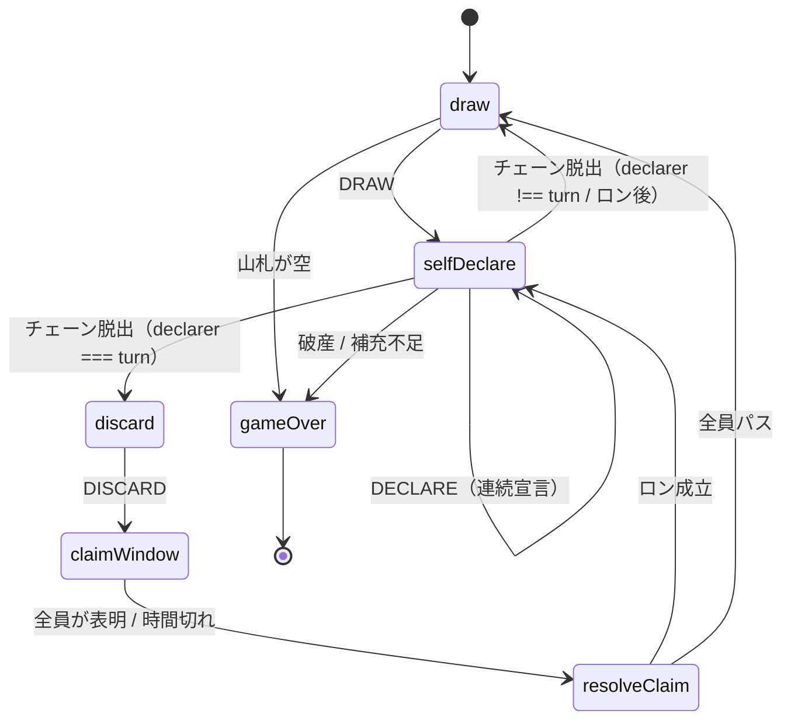

<!-- 生成日: 20260807 -->

# プロジェクト用語集 (Glossary)

## 概要

本プロジェクトで使用する用語の定義を管理する。
ドメインが日本語の麻雀系ゲームであるため、**日本語の概念とコード上の識別子の対応**を
固定することが本書の最大の目的である。同じ概念に複数の名前を付けない。

**更新日**: 2026-08-07

## 用語対応表（クイックリファレンス）

コードを書くときはこの表の右側を使う。

| 日本語           | コード上の識別子       | 型・関数の例                          |
| ---------------- | ---------------------- | ------------------------------------- |
| 役               | `yaku`                 | `YakuCandidate` / `findYaku`          |
| 役の種類         | `YakuKind`             | `'triple' \| 'group3' \| ...`         |
| 3カード          | `triple`               | `YakuKind = 'triple'`                 |
| N人組            | `groupN`               | `'group3' / 'group4' / 'group5'`      |
| 同色             | `sameColor`            | `YakuCandidate.sameColor`             |
| ボーナスメンバー | `bonusMember`          | `bonusMemberIds`                      |
| 和了             | `win`                  | `WinKind` / `applyWin`                |
| ツモ             | `tsumo`                | `settleTsumo`                         |
| ロン             | `ron`                  | `settleRon`                           |
| 割り込み宣言     | `claim`                | `ClaimDecision` / `resolveClaimWinner` |
| 宣言             | `declare`              | `DECLARE` / `declarer`                |
| 連続宣言         | `chain`                | `chainCount` / `maxChainDeclare`      |
| 山札             | `wall`                 | `GameState.wall`                      |
| 手札             | `hand`                 | `Player.hand`                         |
| 河（捨て札置き場） | `discards`           | `Player.discards`                     |
| 捨てる           | `discard`              | `DISCARD` / `chooseDiscard`           |
| 配牌             | `deal`                 | `deal(deck, rules)`                   |
| 待ち             | `wait`                 | `computeWaits` / `WaitInfo`           |
| 補充             | `refill`               | `Refilled` イベント                   |
| 精算             | `settle`               | `settle.ts` / `SettlementResult`      |
| 順位             | `ranking`              | `GameOver.ranking`                    |
| 山切れ           | `wallEmpty`            | `GameOverReason`                      |
| 破産             | `bankrupt`             | `GameOverReason`                      |
| グループ記号     | `symbol`               | `Group.symbol` / `groupSymbolOf`      |
| 持ち時間         | `turnTimer`            | `RulesConfig.turnTimer` / `decideTimeout` |
| 精算（カジノ）   | `payout`               | `computePayout` / `PayoutBreakdown`   |
| 所持コイン       | `wallet`               | `AppState.wallet` / `Prefs.wallet`    |
| ロスター         | `roster`               | `Roster` / `validateRoster`           |
| メンバー         | `member`               | `Member` / `MemberId`                 |
| グループ         | `group`                | `Group` / `GroupId`                   |

## ドメイン用語

### ポカジャン

**定義**: 「ホロライブドリームス（ホロドリ）」のカジノミニゲーム「ポカジャン！」、
および本プロジェクトが再現するそのルール。

**説明**: 麻雀・ドンジャラの簡略版。4人打ちで、役は2系統しかない。
**和了しても局が終わらない**（消費したカードを補充して続行する）点が最大の特徴で、
山札が尽きるか誰かが破産するまで打点レースが続く。

**関連用語**: [役](#役やく), [和了](#和了ほうら), [局](#局きよく)

**英語表記**: Pokajan（固有名詞。訳さない）

### 役（やく）

**定義**: 得点を得るためのカードの組み合わせ。

**説明**: 本ゲームには2系統・4種類の役しかない。

| 役      | 条件                       | 基本点 | 同色時 |
| ------- | -------------------------- | ------ | ------ |
| 3カード | 同一メンバーのカード3枚    | 120    | 840    |
| 3人組   | 3人グループ全員を1枚ずつ   | 180    | 540 ※ |
| 4人組   | 4人グループ全員を1枚ずつ   | 300    | 840    |
| 5人組   | 5人グループ全員を1枚ずつ   | 480    | 1800   |

※ 3人組の同色点のみ出典が見つからず推定値。

**重要な性質**: **点数はカードの選び方に依存しない。**
3カードの構成メンバーは1人に固定され、N人組の構成メンバーはグループ全員に固定されるため、
ボーナス枚数が色の選び方で変わらない。したがって「点数を最大化する組み合わせ」を
探索する必要がない。

**関連用語**: [同色](#同色どうしよく), [ボーナスメンバー](#ボーナスメンバー)

**英語表記**: yaku（`YakuKind` / `YakuCandidate`）

### 同色（どうしょく）

**定義**: 役を構成するカードがすべて同じ色であること。

**説明**: 大幅な加点になる。倍率は役ごとにばらつきがあり（7倍 / 2.8倍 / 3.75倍）、
**計算式ではなくルックアップテーブル**で管理する。

**実装上の注意**: `sameColor` は**実際に消費するカードの色から導出**する。
ループの出自から決めると、「同色の点数 > 通常の点数」という
`RulesConfig` が強制していない関係に暗黙に依存してしまう。

**英語表記**: sameColor

### ボーナスメンバー

**定義**: 開局時に選ばれる特別なメンバー。役に含まれると1枚につき +90点が加算される。

**説明**: 原作では「ボーナスホロメン」と呼ばれる。本プロジェクトはキャラクターを
ユーザー定義にしているため「ボーナスメンバー」と呼ぶ。

**選出の制約**: 母集団は「登場メンバー全員」ではなく**山札に実際に含まれるメンバー**。
プールから100枚を抜き出す際、あるメンバーの9枚すべてが山札外に落ちることがあり、
その場合ボーナスが一度も引けない「**死にボーナス**」になるため。

**英語表記**: bonus member（`bonusMemberIds`）

### 和了（ほうら）

**定義**: 役を成立させて点数を得ること。

**説明**: 本ゲームでは**和了しても局が終わらない**。消費したカードは即時補充され、
補充で新たな役ができれば続けて宣言できる（連続宣言）。
「和了 = 局の終わり」という前提のコードは書けない。

**種別**: [ツモ](#ツモ) と [ロン](#ロン) の2つ。

**英語表記**: win（`WinKind` / `applyWin`）

### ツモ

**定義**: 自分の手番で、自分の手札だけで役を成立させること。

**支払い**: 自分以外の**全員が等分**を支払う（4人なら1人1/3ずつ）。

**実装上の注意**: 全ての点数が3の倍数であるため、整数演算だけで分配が完結する。
ルール値を変更する際も3の倍数を維持すること。

**英語表記**: tsumo（`settleTsumo`）

### ロン

**定義**: 他家の捨て札を使って役を成立させること。**手番に関係なく割り込める**。

**支払い**: 捨てたプレイヤー（放銃者）が**全額**を支払う。

**成立条件**: 「**その1枚がなければ成立しない**」こと。
既に手の内で成立している役でロンを主張することはできない。

**意図的な例外**: 混色で既に成立している役でも、その1枚によって**同色版に格上げされる**
場合はロンとして認められる。誤ロン防止のちょうど裏返しであり、
カード集合の比較だけで判定するとこの正当なロンまで弾いてしまう。

**フリテンは存在しない。**

**英語表記**: ron（`settleRon`）

### 割り込み宣言 / 頭ハネ（あたまはね）

**定義**: 他家の捨て札に対して複数人がロンを宣言したとき、1人だけが成立すること。

**優先度**:

1. 点数が高い役
2. 同点なら、捨てたプレイヤーから反時計回りに近いプレイヤー

**説明**: 優先されなかったプレイヤーは何も得ず、支払いも発生しない。

**英語表記**: claim（`ClaimDecision` / `resolveClaimWinner`）

### 連続宣言（チェーン）

**定義**: 和了後の補充で新たな役が成立した場合に、続けて宣言できること。

**説明**: 補充のたびに山札が減るため理論上は必ず終わるが、
暴走検知のガードとして `maxChainDeclare`（既定8回）を置いている。

**重要**: ガードは「宣言を例外で弾く」のではなく「**遷移でチェーンを抜ける**」形で実装する。
「役が揃えば必ず宣言する」CPU を例外で止めないため。

**ロン後の連続宣言はツモとして精算される**（2回目以降は捨て札を消費していないため）。

**英語表記**: chain（`chainCount`）

### 待ち / リーチ表示

**定義**: あと1枚で役が完成する状態、およびその表示。

**説明**: 原作では、待ちに寄与する手札のカードが**黄色枠**で強調される。
本プロジェクトも同じ表現を採る。

**制約**: `computeWaits` は**1手先（テンパイ）専用**。
CPU が2手以上先を評価する用途に転用してはいけない。

**英語表記**: wait（`computeWaits` / `WaitInfo`）

### 局（きょく）

**定義**: 対局の開始から終了までの1単位。

**終了条件**:

| 理由        | 条件                                                     |
| ----------- | -------------------------------------------------------- |
| `wallEmpty` | 山札が尽きた / 補充に必要な枚数を山札が供給できない      |
| `bankrupt`  | 誰かの点数が0以下になった                                |

両方が同時に成立した場合は `bankrupt` を優先する。

**英語表記**: game（`GameState` / `createGame`）

### 山札 / 河 / 手札

| 用語   | 定義                                   | コード       |
| ------ | -------------------------------------- | ------------ |
| 山札   | 未使用のカードの列。先頭から引かれる   | `wall`       |
| 手札   | プレイヤーが持つカード（通常7枚）      | `hand`       |
| 河     | 捨てたカードの置き場                   | `discards`   |

**手札枚数の規則**: 常に7枚。**引いてから捨てるまでのツモ中の手番プレイヤーだけ8枚**。
ロンによる連続宣言中は、既に捨て終わった手番プレイヤーも7枚である点に注意。

### 山札構成

**定義**: 1局で使うカードの作られ方。

```
1メンバー = 3色 × 3枚 = 9枚
1局に登場するグループ = 4つ（メンバー12〜16人 → プール108〜144枚）
プールをシャッフルして先頭 100枚 を山札にする
```

**重要な帰結**: **山札に入らないカードが存在する。**
そのため残りカードの枚数を完全には読み切れない。

**英語表記**: deck / wall（`buildDeck` / `buildCardPool`）

### ロスター

**定義**: メンバーとグループの定義一式。**ユーザーが編集・共有する単位**。

**説明**: 本プロジェクトの中心的な価値。組織のメンバーを部署ごとのグループに
割り当てれば、その組織だけのゲームになる。画像込みの単一ファイルとして
書き出し・読み込みができる。

**制約**:

- グループ数 ≥ `groupsPerGame`（既定4）
- 各グループの人数は 3〜5人（役判定が対応する範囲）
- 最も人数の少ない `groupsPerGame` 個のグループの合計カード枚数 ≥ `deckSize`

**英語表記**: roster（`Roster` / `validateRoster`）

### グループ記号

カードの左上と右下に表示される、そのカードが属する**グループを示す1〜2文字**。
トランプのスート（♠♥♦♣）にあたる。

**目的**: カードだけを見てグループを判別できるようにすること。
名前と画像だけでは、そのメンバーがどのグループかを場の情報と照合しないと分からない。
トランプと同じく**左上と右下**に置き、右下は 180 度回転させる。
手札を扇状に重ねてもどちらかの角が必ず見えるため、重ねたままグループを数えられる。

**既定値**: `Group.symbol` を省略するとグループ名の1文字目が使われる。
「ステラ組」「ソレイユ組」のように1文字目が似ている場合に区別できるよう、
ロスター設定画面から上書きできる。

**関連**: `groupSymbolOf` / `groupSymbolsByMember`（`src/ui/labels.ts`）

### ダマポカジャン

**定義**: 安手の役を見送り、同色の高得点を狙う戦術。

**説明**: v1 の CPU には非搭載（「役が揃えば即宣言」で固定）。
実機の平均打牌数（35）に本実装（21.7）が届かない原因はここにあると分析している。

**優先度**: Post-MVP（P2）

## 技術用語

### Vite

**定義**: フロントエンドのビルドツール・開発サーバ。

**公式サイト**: https://vite.dev

**本プロジェクトでの用途**: 開発サーバと本番ビルド。出力が静的ファイルのみで、
そのまま静的ホスティングに載る。

**バージョン**: ^8.2.0

### React

**定義**: 宣言的な UI ライブラリ。

**公式サイト**: https://react.dev

**本プロジェクトでの用途**: 画面の描画。`useReducer` がエンジンのリデューサと
相性が良い。**エンジン層からは import 禁止**。

**バージョン**: ^19.2.8

### Vitest

**定義**: Vite と設定を共有するテストランナー。

**公式サイト**: https://vitest.dev

**本プロジェクトでの用途**: 全テスト。環境は `node` で、DOM が必要な箇所は
`renderToStaticMarkup` で代替し jsdom を導入していない。

**バージョン**: ^4.1.10

### oxlint

**定義**: Rust 製の高速な JavaScript / TypeScript リンタ。

**公式サイト**: https://oxc.rs

**本プロジェクトでの用途**: 静的解析。特に `no-restricted-imports` による
**レイヤー間の依存制約の機械的な担保**。ESLint は使っていない。

**バージョン**: ^1.75.0

**関連ドキュメント**: [architecture.md](architecture.md#アーキテクチャパターン)

### IndexedDB

**定義**: ブラウザに構造化データを保存する Web API。Blob を扱える。

**本プロジェクトでの用途**: キャラクター画像の Blob 保存。
localStorage の約5MB制限では20人分の顔写真が入らないため、画像は必ずこちらに置く。

### mulberry32

**定義**: 32bit の内部状態を1つだけ持つシード付き擬似乱数生成アルゴリズム。

**本プロジェクトでの用途**: エンジンの乱数源。内部状態が整数1個で済むため
`GameState` に保持してリプレイするのが容易。

**実装箇所**: `src/engine/rng.ts`

## 略語・頭字語

### PRD

**正式名称**: Product Requirements Document

**意味**: プロダクト要求定義書。「何を作るか」を定義する。

**本プロジェクトでの使用**: `docs/product-requirements.md`

### MVP

**正式名称**: Minimum Viable Product

**意味**: 実用最小限の製品。本プロジェクトでは優先度 P0 の機能群を指す。

### CPU

**意味**: コンピュータが操作する対戦相手。本プロジェクトでは3人。

**本プロジェクトでの使用**: `Player.isCpu` / `src/engine/ai.ts`

### TTI

**正式名称**: Time to Interactive

**意味**: ページが操作可能になるまでの時間。

**本プロジェクトでの使用**: 非機能要件の目標値（2秒以内）

## アーキテクチャ用語

### レイヤードアーキテクチャ

**定義**: 責務ごとに層を分け、依存の向きを一方向に保つ構造。

**本プロジェクトでの適用**:

```
UI（src/ui/）
  ↓
永続化（src/storage/） / 設定（src/config/）
  ↓
エンジン（src/engine/）  ← 何にも依存しない
```

**関連コンポーネント**: `.oxlintrc.json` の `no-restricted-imports` が
違反を機械的に検出する。

### 純粋リデューサ

**定義**: 状態とアクションから次の状態を返す、副作用のない関数。

**本プロジェクトでの適用**: `reduce(state, action, rules) => { state, events }`

**特徴**:

- **タイマーを持たない**。時間の経過は UI 層が `TICK` で供給する
- 乱数を使わない（`Math.random()` / `Date` を参照しない）
- 引数を破壊しない

**帰結**: 対局の全経過が「初期シード + アクション列」だけで完全に再現できる。

### イベント駆動の演出

**定義**: 状態と一緒に演出用のイベント列を返し、ロジックとアニメーションを疎結合にする方式。

**本プロジェクトでの適用**: `reduce` が `GameEvent[]` を返し、UI がそれを見て
アニメーションを再生する。フェーズをポーリングして演出を組み立てない。

**注意**: 過渡フェーズ `resolveClaim` は `reduce` の戻り値には現れないため、
フェーズだけを見ていると割り込みの発生を検知できない。

### 情報遮断（AiView）

**定義**: CPU に公開情報だけを渡し、隠し情報へ到達する経路を型として存在させない設計。

**本プロジェクトでの適用**: AI 関数は `GameState` を受け取らず `AiView` を受け取る。
`toAiView` が `GameState` に触れる唯一の場所。

**帰結**: カンニングは「気をつける」規律ではなく**型エラー**になる。

### 点数保存則

**定義**: 4人の点数の合計が対局を通じて変化しないこと。

**本プロジェクトでの適用**: 支払い処理で「引いた額」と「足した額」を
同一の変数にすることで構造的に保証する。残高不足でクランプが発生しても崩れない。

**検証**: 100局の全ステップで検査する。

### カード保存則

**定義**: 場に存在するカードの総数と `uid` の一意性が保たれること。

```
山札 + 全員の手札 + 全員の河 + 成立済みの役 = deckSize（常に100）
```

**重要性**: 手札枚数だけを見るテストでは
「補充で山札のカードが複製された」「消費したカードが河にも残っている」を見逃す。
**最重要の検査項目**とする。

## ステータス・状態

### Phase（対局の進行フェーズ）

| フェーズ       | 意味                                   | 受け付けるアクション          |
| -------------- | -------------------------------------- | ----------------------------- |
| `draw`         | 手番プレイヤーが山から1枚引く          | `DRAW`                        |
| `selfDeclare`  | 引いた後の宣言チャンス（連続宣言含む） | `DECLARE` / `SKIP_DECLARE`    |
| `discard`      | 1枚捨てる                              | `DISCARD`                     |
| `claimWindow`  | 他家の割り込み受付                     | `CLAIM` / `PASS` / `TICK`     |
| `resolveClaim` | **過渡フェーズ**（外部から見えない）   | —                             |
| `gameOver`     | 終局                                   | —（どのアクションも無効）     |

**`ObservablePhase`**: `reduce` が外部に返しうるフェーズ（`resolveClaim` を除いた型）。
過渡フェーズが漏れ出したらコンパイルエラーになる。

**状態遷移図**:



### GameOverReason（終了理由）

| 値          | 意味                                             |
| ----------- | ------------------------------------------------ |
| `wallEmpty` | 山札が尽きた                                     |
| `bankrupt`  | 誰かの点数が0以下になった（優先して報告される）  |

### ClaimDecision（割り込みの意思表示）

| 値              | 意味                       |
| --------------- | -------------------------- |
| `YakuCandidate` | その役でロンを宣言する     |
| `'pass'`        | 見送る                     |
| `null`          | **まだ表明していない**     |

キーが存在しない場合は「そもそも割り込みの対象外」（捨てた本人）を意味する。

## データモデル用語

### Card

**定義**: 山札・手札・河を構成する1枚。

**主要フィールド**:

- `uid`: 1局を通じて一意な識別子。カード保存則の検査に使う
- `memberId`: 描かれるメンバー
- `color`: `'pink' | 'blue' | 'orange'`

**制約**: 同じ `memberId` × `color` の組は最大 `copiesPerMemberColor`（3）枚。

### Member / Group / Roster

| 型       | 定義                       | 主要フィールド                     |
| -------- | -------------------------- | ---------------------------------- |
| `Member` | カードに描かれる1人        | `id` / `name` / `imageId` / `accent` |
| `Group`  | メンバーのまとまり（3〜5人）| `id` / `name` / `memberIds`       |
| `Roster` | 定義一式                   | `version` / `members` / `groups`   |

**制約**: `Group.memberIds` は `Member.id` を参照する外部キー相当。
グループ内で重複してはいけない。

### GameState

**定義**: 対局の状態スナップショット。**純粋なデータで、ルール値を含まない。**

**注意が必要なフィールド**:

| フィールド      | 説明                                                             |
| --------------- | ---------------------------------------------------------------- |
| `turn`          | 手番プレイヤー                                                   |
| `declarer`      | **宣言権を持つプレイヤー**。ロン連続宣言中は `turn` と食い違う   |
| `lastDiscard` / `lastDiscardBy` | **対で読むこと**。ロン成立後は前者だけ `null` になる |
| `rngState`      | 対局中は変化しない（進行に乱数を使わないことの表明）             |

## エラー・例外

### IllegalActionError

**クラス名**: `IllegalActionError`

**発生条件**:

- そのフェーズが受け付けないアクションが渡された
- 宣言権のないプレイヤーが `DECLARE` を送った
- 手番プレイヤー自身が `CLAIM` / `PASS` を送った
- 既に意思表示済みのプレイヤーが再度表明した
- 手札にないカードを `DISCARD` しようとした
- 成立していない役 / 形の壊れた候補が宣言された
- `rules.playerCount` が対局の人数と一致しない
- 未知のアクション種別が渡された

**対処方法**: UI は不正なアクションを出さないよう操作を制御する。
このエラーが到達したらバグである。

**設計意図**: **不正なアクションを黙って無視しない。**
無視すると UI のバグが「何も起きない」という形で隠れてしまう。

**実装箇所**: `src/engine/errors.ts`

### RosterValidationError

**クラス名**: `RosterValidationError`（`errors: readonly string[]` を持つ）

**発生条件**: `setupGame` に対局が成立しないロスターが渡された。

**対処方法**: 通常は `validateRoster` を先に呼び、**例外ではなくエラー一覧**を
受け取って UI に表示する。この例外は最後の砦。

**実装箇所**: `src/engine/deck.ts`

**例**:

```typescript
const validation = validateRoster(roster, rules)
if (!validation.ok) {
  // ユーザーに validation.errors を表示する（例外にしない）
}
```

## 計算・アルゴリズム

### 点数計算

**定義**: 役の点数を求める。

**計算式**:

```
点数 = scores[役種][同色 ? 'sameColor' : 'base'] + bonusPerCard × ボーナス枚数
```

**実装箇所**: `src/engine/score.ts`

**例**:

```
入力: kind='triple', sameColor=true, bonusCount=3
出力: 840 + 90 × 3 = 1110
```

**設計上の注意**: `scoreYaku` は**カードを引数に取らない**。
点数がカードの選び方に依存しないという不変条件を型レベルで強制している。

### 精算（0クランプ）

**定義**: 点数を移動させる。残高不足でも総和を変えない。

**計算式**:

```
payable = max(scores[from], 0)
paid    = min(owed, payable)
scores[from] -= paid
scores[to]   += paid        ← 引いた額と足す額が同一の変数
```

**実装箇所**: `src/engine/settle.ts`

**例**:

```
入力: scores=[1000, 30, 1000, 1000], ツモ和了(winner=0, amount=120)
     share = floor(120 / 3) = 40
出力: scores=[1110, 0, 960, 960]   ← 1番は30しか払えない
     総和 3030 は変わらない
```

### 割り込み優先度の解決

**定義**: 複数のロン宣言から1人を選ぶ。

**計算式**:

```
1. score が最大のもの
2. 同点なら (playerId - discarder + playerCount) % playerCount が最小のもの
```

**実装箇所**: `src/engine/claims.ts`

**例**:

```
入力: discarder=2, claims={ 0: 120点, 3: 120点 }
     距離: 0 → (0-2+4)%4 = 2 / 3 → (3-2+4)%4 = 1
出力: playerId=3 が勝者
```

### CPU のターゲット評価

**定義**: 狙える役の価値を割り引いて評価し、捨て札を選ぶ。

**計算式**:

```
value = score / (need + 1) ^ patience
cost(カード) = そのカードが寄与するターゲットの value の合計
終盤かつ safety > 0 なら cost += safety × (色数 - そのメンバーが河に出ている枚数)
→ cost が最小のカードを捨てる
```

**実装箇所**: `src/engine/ai.ts`

**難易度プリセット**:

| プリセット | patience | safety |
| ---------- | -------- | ------ |
| easy       | 2        | 0      |
| normal     | 1.5      | 1      |
| hard       | 1        | 2      |

### カジノ精算

**定義**: 対局結果を所持コインの増減に変換する。

**計算式**:

```
payout = floor(最終点数 × BET倍率 × 順位倍率) − BET額
```

**倍率**:

| 項目       | 値                                    |
| ---------- | ------------------------------------- |
| BET倍率    | 1000コイン → 1倍 / 2000コイン → 2倍   |
| 順位倍率   | 1位 2.5 / 2位 1.5 / 3位 1.0 / 4位 1.0 |

**実装箇所**: `src/engine/payout.ts`（Step 5 で実装予定）
